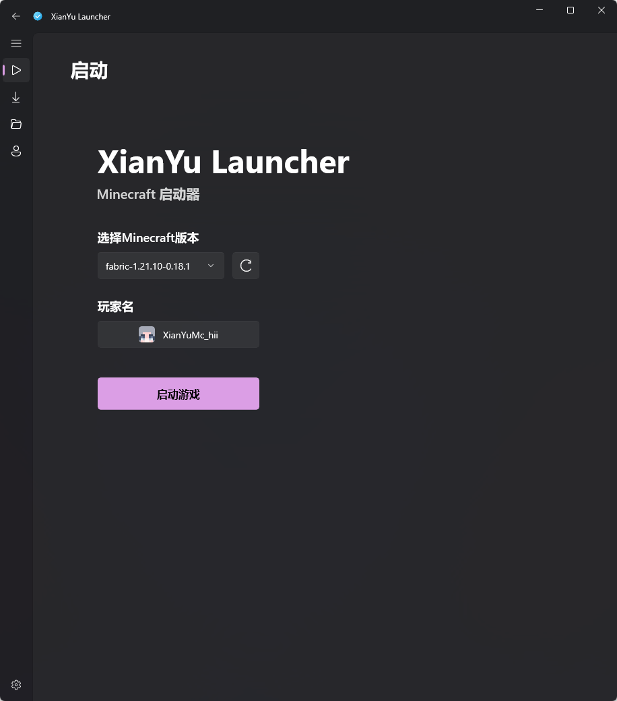

# XianYu Launcher

A UI-perfect Minecraft Java Edition launcher (XianYuLauncher) - Unofficial, no affiliation with Mojang Studios or Microsoft

## Status

The launcher is currently in active development and not yet feature-complete. Core functionalities are being polished, and more features will be added in future updates.

## Current Version Screenshots

### Launch Page

*Screenshot of the main launch interface, providing quick access to start your Minecraft journey.*

### Version Download Page

*Screenshot of the download interface, supporting official Minecraft version retrieval and one-click installation.*

### Version Management Page

*Screenshot of the version management interface, allowing users to view, edit, and delete installed Minecraft versions.*

## Note

All screenshots are from the development build and may differ from the final release. We appreciate your patience and support during the development process!
